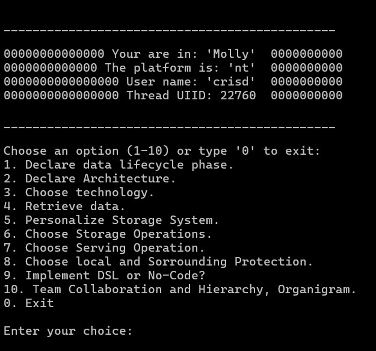

# DataPulseSystem
This code offers  offer improving query performance in a data lake, data modelling, batch transformations, security patching

#Data Pulse System allows you to manipulate data and query information from a several sources such as API, GraphQL, OLTP, CRUD.

